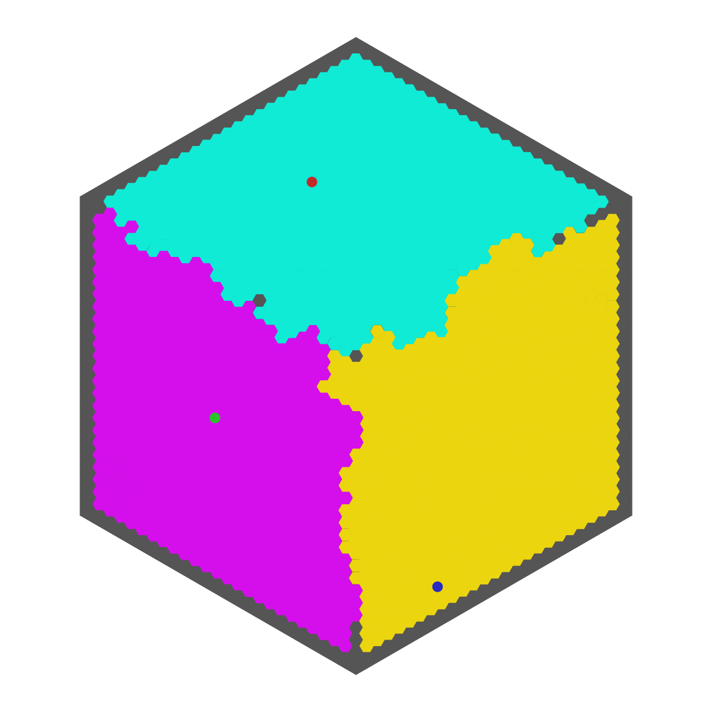

# Pong Wars Hex



Welcome to Pong Wars Hex! This is a simple and fun website that you can stare at for hours. It is hosted [Here](https://hex-pong-wars.whichoneiwonder.com/)

## About

This project is a fork of the original [Pong Wars](https://github.com/vnglst/pong-wars) created by vnglst. In this version, the layout has been converted to a hex-grid format with the help of the "red-blob" hex library.

## Features

- Classic Pong gameplay with a hex-grid twist
- View in 2, 3, or 6-player modes

## Fork your own version

To clone your own version and start tweaking Pong Wars Hex, simply clone this repository and open the `index.html` file in your browser.

```bash
git clone https://github.com/whichoneiwonder/pong-wars-hex.git
cd pong-wars-hex
open index.html
```

Enjoy!

## Credits

- Original Pong Wars by [vnglst](https://github.com/vnglst/pong-wars)
- Hex-grid implementation using the hex library from [Red Blob Games](http://www.redblobgames.com/grids/hexagons/)

## License

This project is licensed under the MIT License.

The included Red Blob Games hex-grid library is licenced under the Apache 2.0 Licence.
